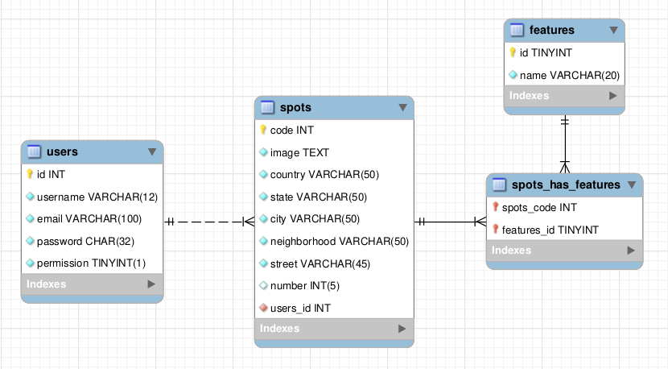
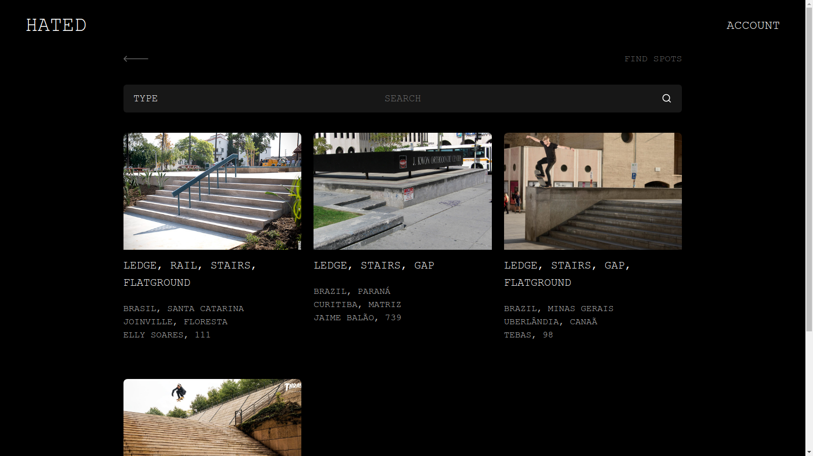
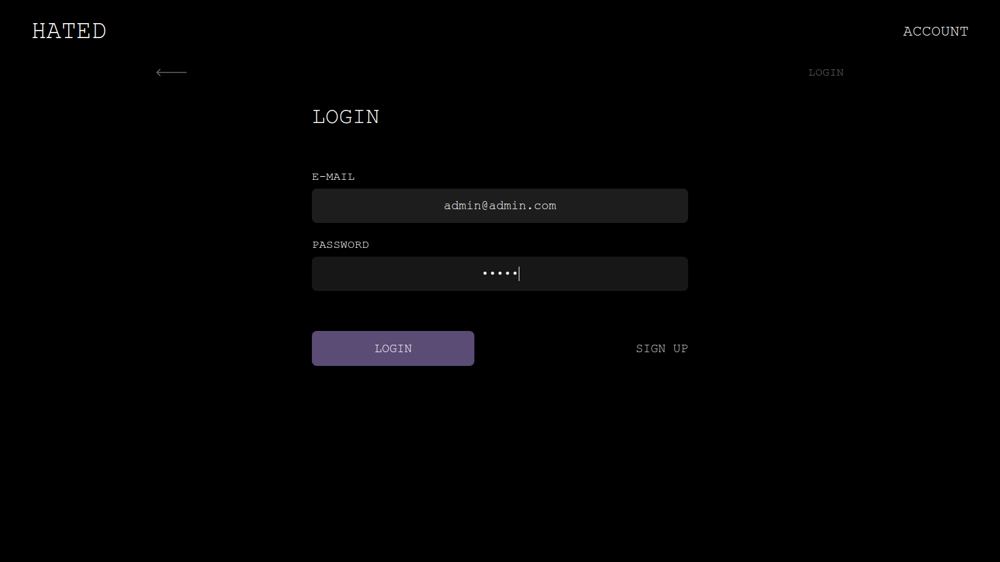
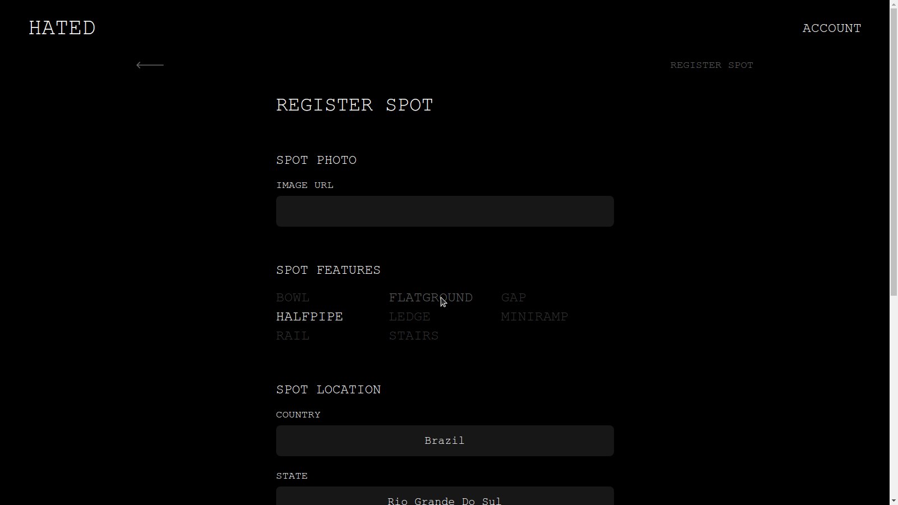
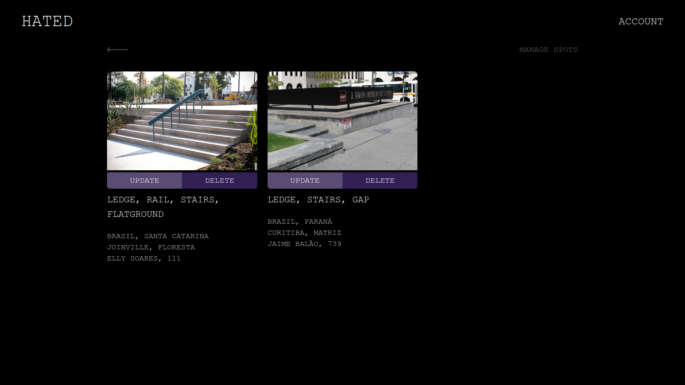

  Qualquer local onde é possível andar de skate pode ser considerado um spot, de quadras de basquete à escadarias do metrô, spots existem em todas as cidades, em diferentes formatos, para diferentes modalidades. Com o propósito de incentivar a prática esportiva do skate e fortalecer a comunidade, o <i>Hated Spot Share</i>, permite encontrar spots novos e compartilhar seus spots preferidos.

  Não veio para substituir nenhuma rede social, é simples, não é difícil de usar, os atletas só precisam criar uma conta caso queiram compartilhar um spot. Para encontrar o melhor spot para você, basta usar a barra de pesquisa, filtrando os spots por endereço.

## ENTRADAS

  <b>Registro de Usuário:</b> tem como propósito registrar os usuários no sistema, para que possam usufruir de todas as funcionalidades disponíveis. <i>Dados necessários:</i> e-mail, nome de usuário, senha.
  
  <b>Registro de spot:</b> tem como propósito registrar spots, após registro o usuário é direcionado à página principal. <i>Dados necessários:</i> imagem (URL), caracterísitcas, país, estado, cidade, bairro, rua.

## PROCESSOS

  <b>Autenticação de usuário:</b> tem como propósito autenticar o acesso ao sistema, verificando se o usuário pode acessá-lo ou executar certa ação no sistema. <i>Dados necessários:</i> email, senha, permissão. 
  
  <b>Excluir spot:</b> tem como propósito excluir um spot registrado, somente o usuário que registrou o spot e o administrador podem realizar a exclusão. <i>Dados necessários:</i> código do spot.
  
  <b>Atualizar spot:</b> tem como propósito atualizar um spot registrado, somente o usuário que registrou o spot e o administrador podem realizar a atualização. <i>Dados necessários:</i> imagem (URL), caracterísitcas, país, estado, cidade, bairro, rua.
  
  <b>Atualizar cadastro:</b> tem como propósito atualizar o cadastro do usuário. <i>Dados necessários:</i> e-mail, nome de usuário, senha.
  
  <b>Pesquisa de spots:</b> tem como propósito ajudar o usuário a encontrar spots, através de uma barra de pesquisa. O usuário pode especificar onde quer que seja feita a pesquisa, país, estado, cidade, bairro ou rua. <i>Dados necessários:</i> texto para busca.
  
  <b>Logout:</b> tem como propósito desconectar o usuário do sistema. <i>Dados necessários:</i> dados da sessão.

## SAÍDAS

  <b>Visualização de spots:</b> tem como propósito exibir os spots registrados no sistema. <i>Dados necessários:</i> imagem, caracterísitcas, país, estado, cidade, bairro, rua, número (se registrado).
  
  <b>Gerenciamento de spots:</b> tem como propósito exibir todos os spots que o usuário registrou, permitindo a atualização e exclusão de spots. O administrador tem acesso a todos os spots, assim como tem a permissão para atualizar e excluir qualquer spot. <i>Dados necessários:</i> imagem, caracterísitcas, país, estado, cidade, bairro, rua, número (se registrado).

## BANCO DE DADOS

## CAPTURAS DE TELA
***Encontrar spots***

***Login de usuário***

***Compartilhar spot***

***Gerenciar spots***

## INSTALAÇÃO
1. Instale o XAMPP;
2. Baixe ou clone o repositório na pasta *xampp/htdocs*;
3. Inicie os servidores no XAMPP;
4. Importe o banco de dados no *phpmyadmin*.